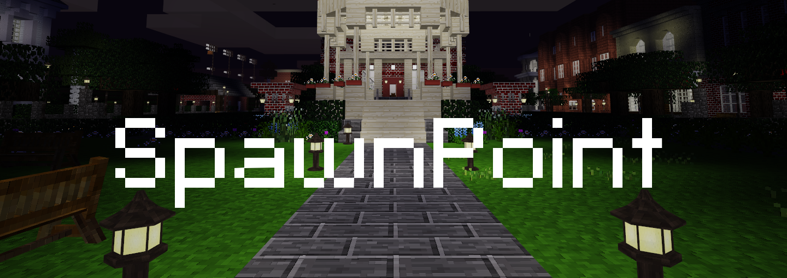

Static Spawnpoint [spawnpoint]
================================
* License: MIT (see LICENSE)
* [Download Latest Version](https://github.com/octacian/spawnpoint/archive/master.zip)
* ...or browse the code on [GitHub](https://github.com/octacian/spawnpoint)

This is a rather simple mod introducing two commands to set a static spawnpoint and to teleport to it. Yes, I know you can set this in `minetest.conf`, however, doing so causes the spawnpoint to be the same across all of your worlds (very inconvenient). Instead of using `minetest.conf`, this mod stores the spawnpoint (and other settings) within the world directory itself. This allows each and every world to have a different spawnpoint and configuration.

The most unique thing about this spawn mod is that it includes a feature allowing you to set the time between executing the command until the player is actually teleported. You can also enable a setting which causes the teleportation to be interrupted if the player moves within the original time.

### Commands
- `/spawnpoint`: Display spawnpoint position if set (also see configuration section)
- `/spawn <player>`: Teleports you or the player specified to the spawnpoint (requires `spawn` privilege, and `bring` privilege to teleport another player)
- `/setspawn <position>`: Sets the spawn to the position specified (in format `x, y, z`) or to your current location (requires `server` privilege)

__Note:__ If no spawnpoint is specified and a player attempts to execute `/spawn`, he/she will be told "No spawnpoint set!"

### Configuration
The different "variables" of SpawnPoint can be configured per-world using the `/spawnpoint` command (requires server privilege). This command displays the spawnpoint if no parameters are provided, but when a setting name is provided, the value of the setting is returned (assuming such a setting exists). If a setting name and value is provided, the setting is changed. Valid setting names are listed below.

* `time`: Time before teleportation is completed (if `0` teleportation is immediate)
* `do_not_move`: Whether a player should be required to not move to allow teleportation to be successful
* `pos`: Position in the format `(<x>,<y>,<z>)` - can only be set via `/setspawn` or manually in configuration files

This per-world configuration (including the spawn position itself) is stored in the world directory. If Minetest 0.4.16's new modstorage is available, SpawnPoint will use that to store configuration. Otherwise, configuration will be handled by the Minetest `Settings` API and placed in a `spawnpoint.conf` file. If you would like to configure SpawnPoint manually, create a `spawnpoint.conf` file in the world directory and assign values to the applicable settings as documented above, each setting on a new line in the format `setting_name = setting_value`.

Initially, SpawnPoint stored all settings in a multi-line `spawnpoint.conf` file, however, this made very little sense as setting weren't named. With the new configuration scheme as documented above, compatibility code has been implemented causing all the old settings to be imported into the newest format possible. When the formatted settings method is used with `spawnpoint.conf`, all configuration is automatically imported to Minetest modstorage as well when it becomes available. After importing takes place from `spawnpoint.conf`, the file is removed.

Screenshot was taken at spawn on the awesome [HOMETOWN](https://forum.minetest.net/viewtopic.php?f=10&t=16699) server!
